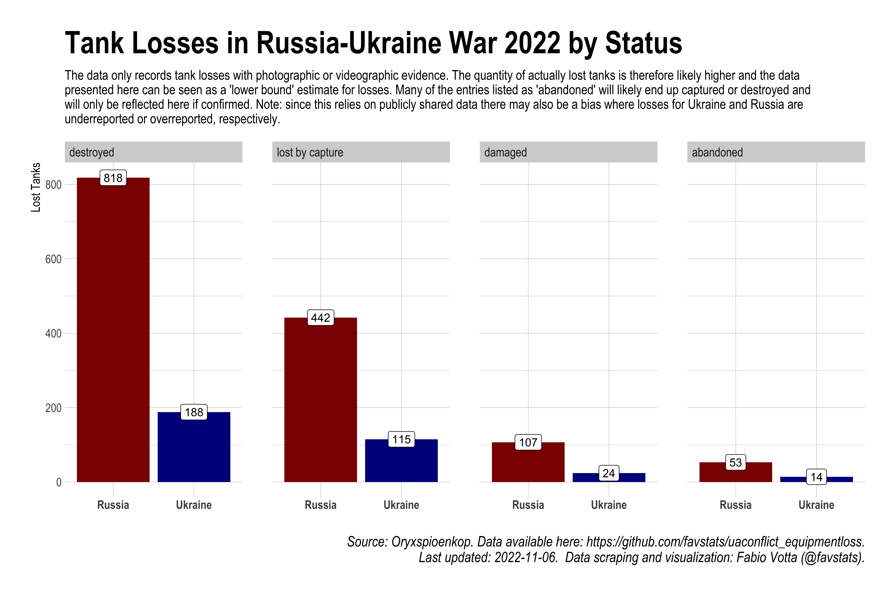
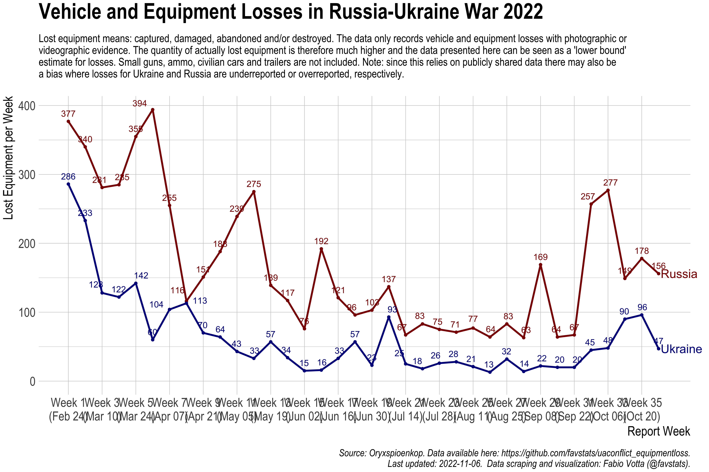

<!-- README.md is generated from README.Rmd. Please edit that file -->

# Equipment losses in Russia-Ukraine War 2022

This repo scrapes [this
list](https://www.oryxspioenkop.com/2022/02/attack-on-europe-documenting-equipment.html)
by Oryxspioenkop (daily) to document and visualize equipment losses in
the Russia-Ukraine war.

Oryxspioenkop says about this dataset:

> This list only includes destroyed vehicles and equipment of which
> photo or videographic evidence is available. Therefore, the amount of
> equipment destroyed is significantly higher than recorded here. Small
> arms, munitions, civilian vehicles, trailers and derelict equipment
> (including aircraft) are not included in this list. All possible
> effort has gone into discerning the status of equipment between
> captured or abandoned. Many of the entries listed as ‘abandoned’ will
> likely end up captured or destroyed. Similarly, some of the captured
> equipment might be destroyed if it can’t be recovered. ATGMs and
> MANPADS are included in the list but not included in the ultimate
> count. The Soviet flag is used when the equipment in question was
> produced prior to 1991.

Note: since this relies on publicly shared data there may also be a bias
where losses for Ukraine and Russia are underreported or overreported,
respectively. While it may be true that Russia is losing much more
equipment than Ukraine, it might be faulty to assume so based on this
data alone.

## Main dataset

The main dataset is `data/oryx_data.rds` but there are also daily `.csv`
to be found in the `data/daily` subfolder. Simply retrieve the data from
the latest available day or from any other timestamp that you would like
to analyze.

``` r
read_csv("data/daily/2022-03-26_oryx_data.csv")
#> Rows: 1798 Columns: 13
#> ── Column specification ────────────────────────────────────────────────────────
#> Delimiter: ","
#> chr  (6): equipment_type, cntry_army, flag, system, status, image_link
#> dbl  (6): total_equipment_type_oryx, total_system_oryx, total_destroyed_oryx...
#> dttm (1): timestamp
#> 
#> ℹ Use `spec()` to retrieve the full column specification for this data.
#> ℹ Specify the column types or set `show_col_types = FALSE` to quiet this message.
#> # A tibble: 1,798 × 13
#>    equipment_type cntry_army flag     system status image_link  total_equipment…
#>    <chr>          <chr>      <chr>    <chr>  <chr>  <chr>                  <dbl>
#>  1 Tanks          Russia     https:/… T-64BV destr… https://i.…                7
#>  2 Tanks          Russia     https:/… T-64BV destr… https://i.…                7
#>  3 Tanks          Russia     https:/… T-64BV destr… https://i.…                7
#>  4 Tanks          Russia     https:/… T-64BV destr… https://i.…                7
#>  5 Tanks          Russia     https:/… T-64BV damag… https://i.…                7
#>  6 Tanks          Russia     https:/… T-64BV captu… https://i.…                7
#>  7 Tanks          Russia     https:/… T-64BV captu… https://i.…                7
#>  8 Tanks          Russia     https:/… T-72A  destr… https://i.…                8
#>  9 Tanks          Russia     https:/… T-72A  destr… https://i.…                8
#> 10 Tanks          Russia     https:/… T-72A  captu… https://i.…                8
#> # … with 1,788 more rows, and 6 more variables: total_system_oryx <dbl>,
#> #   total_destroyed_oryx <dbl>, total_abandoned_oryx <dbl>,
#> #   total_captured_oryx <dbl>, total_damaged_oryx <dbl>, timestamp <dttm>
```

## OCR for timestamping images associated with losses

Each entry on the equipment loss list has an image or source associated
to confirm the loss. In almost all cases the image includes a date which
likely represent the date on which the media file was first seen by the
Oryx team. In order to make use of this timestamp I employ
`Google Cloud Vision API` to extract dates from images of the Oryx
dateset.

The cleaned dataset (with some manual coding) can be found here:
`data/dates_dat.csv` andd can be merged into the main dataset via the
image link. If you prefer the merged dataset then you can use
`date/oryx_data_dates.csv`.

This dataset will only be updated every now and then as it requires some
manual checking. Maybe I try to automate it further in the future :)

## Visualizations

### Overall losses by type


### Tank losses by status



### Overall losses over time



### Overall losses over time by (some) vehicle types


### Overall tank losses over time


